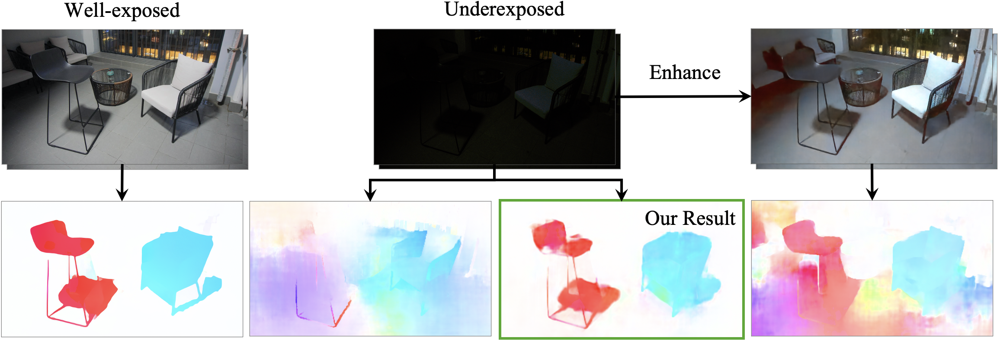

# Optical Flow in the Dark
Optical Flow in the Dark (CVPR 2020)

[Paper](https://openaccess.thecvf.com/content_CVPR_2020/papers/Zheng_Optical_Flow_in_the_Dark_CVPR_2020_paper.pdf)




## Setup

### Pretrained Models

See [PWC-Net_OFDark](https://github.com/mf-zhang/Optical-Flow-in-the-Dark/tree/main/PWC-Net_OFDark) and [FlowNet_OFDark](https://github.com/mf-zhang/Optical-Flow-in-the-Dark/tree/main/FlowNet_OFDark) for details.

### Dataset

See [VBOF dataset](https://github.com/mf-zhang/Optical-Flow-in-the-Dark/tree/main/VBOF%20dataset) for details.

## Test the models

Please download our pretrained [PWC-Net_OFDark](https://github.com/mf-zhang/Optical-Flow-in-the-Dark/tree/main/PWC-Net_OFDark) and [FlowNet_OFDark](https://github.com/mf-zhang/Optical-Flow-in-the-Dark/tree/main/FlowNet_OFDark) models and follow the instructions in the original PWC-Net and FlowNet repositories to test the models on our [VBOF dataset](https://github.com/mf-zhang/Optical-Flow-in-the-Dark/tree/main/VBOF%20dataset).

## Citation

```
@inproceedings{zheng2020optical,
  title={Optical Flow in the Dark},
  author={Zheng, Yinqiang and Zhang, Mingfang and Lu, Feng},
  booktitle={Proceedings of the IEEE/CVF Conference on Computer Vision and Pattern Recognition},
  pages={6749--6757},
  year={2020}
}
```