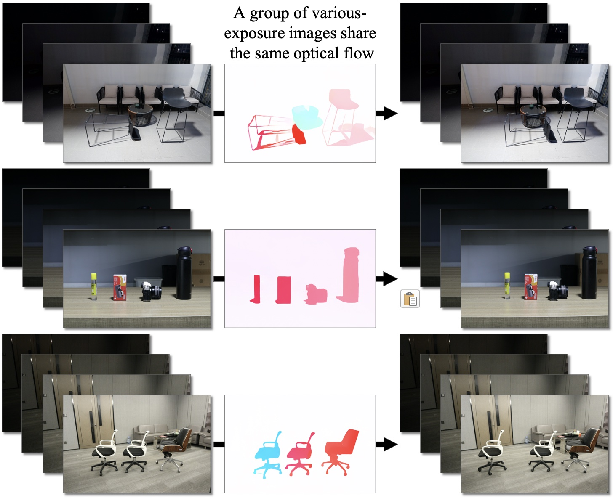

# Various Brightness Optical Flow (VBOF) Dataset

## Prepare the VBOF dataset

1. Download our VBOF dataset (1.23G) [here](https://drive.google.com/drive/folders/1LZR-kKs7kbLdh0QQYp4JmzEviZKhSWkb?usp=sharing).

2. Move `fill_VBOF_data.py` in this repository into the downloaded folder `VBOF_publish`.

3. Run `$ python fill_VBOF_data.py` to fill the `VBOF_publish/VBOF_data` folder with the files in the `VBOF_publish/src` folder.

4. Delete the `VBOF_publish/src` folder and `fill_VBOF_data.py`.

## Explain the VBOF dataset

### Steps to create the VBOF dataset

1. **Collect images**: 
Collect object movement in multiple exposures. (More details in our [paper]( https://openaccess.thecvf.com/content_CVPR_2020/papers/Zheng_Optical_Flow_in_the_Dark_CVPR_2020_paper.pdf).)

2. **Scale the brightness**: 
Normalize the multiple-exposure 14-bit raw images to `[0,1]`, and scale the brightness intensity of each image to a mean value of `0.4`.

3. **Save images**: 
Demosiac the raw images, decrease the resolution, and save the images in 8-bit RGB format. (We publish this well-processed low-resolution version of our dataset in `VBOF_publish/src`.)

4. **Create image pairs**: 
Pair the images into couples and match optical flow references to each image pair. (This is what `fill_VBOF_data.py` do.  The final dataset will be saved in ` VBOF_publish/VBOF_data`.)

### File name explaination in `VBOF_data`

For example,

`12030405_img1.jpg`: collected by camera #12, object position #03 -> position #04, exposure #05 (1:bright, 9:dark), first frame (position #03).

`12030405_img2.jpg`: collected by camera #12, object position #03 -> position #04, exposure #05 (1:bright, 9:dark), second frame (position #04).

`12030405_flow.flo`: optical flow reference for object movement position #03 -> position #04, collected by camera #12.